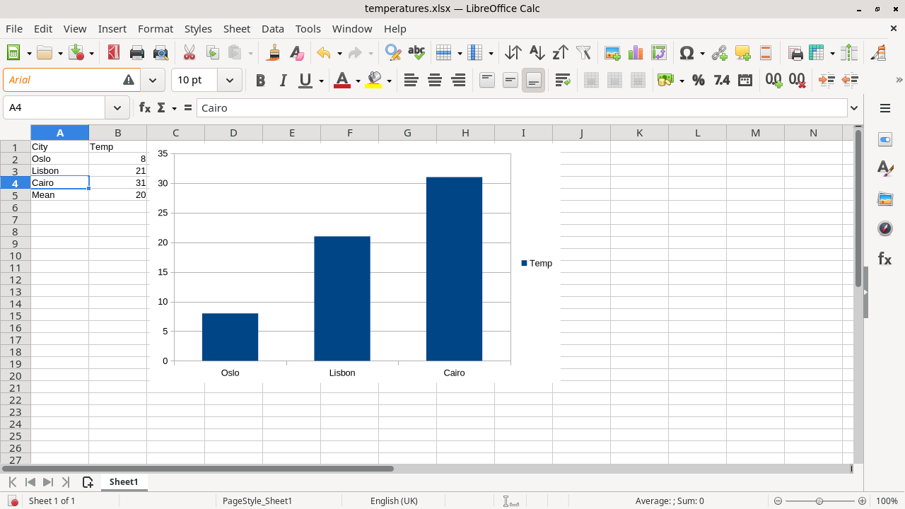

# Agent Desktop

Give your agent its own Linux desktop while you keep using your computer.

Agent Desktop runs persistent, separate graphical sessions controlled through a
CLI or a local MCP server. Agents can launch applications, inspect windows and
accessible UI elements, take screenshots, and send keyboard and pointer input.
You can watch a session or take control when a task needs human interaction.



*A headless session captured with the tool. An agent entered the table and
inserted the chart through the MCP tools while the host desktop stayed in use.*

**Experimental, Linux-first.** Headless sessions have been tested locally on
NixOS/Hyprland and in Ubuntu, Fedora and Arch CI environments. Those checks cover
specific tasks, not every application or desktop installation. See the
[compatibility matrix](docs/COMPATIBILITY.md) for versions and known failures.

Applications run as your user with host filesystem and network access. Separate
display sockets, application profiles and input routing **do not provide a
security sandbox**. The optional host guard reduces accidental host changes.

## What it provides

- Persistent headless labwc sessions with private display sockets and D-Bus.
- Explicit session routing for window focus, screenshots, Unicode typing,
  key chords, clicks, dragging and scrolling.
- Screenshot observation tokens, waits and bounded action sequences to help
  detect changes before acting; verify outcomes after each action.
- Optional AT-SPI element inspection and semantic actions.
- A read-only observer, cooperative human takeover and named login profiles.
- Process supervision, cleanup, bounded screenshot retention and diagnostics.

The runtime uses existing Linux desktop infrastructure and works with existing
agents. It does not require a particular model or cloud service.

## Installation

Use Python 3.12 or newer managed by [uv](https://docs.astral.sh/uv/). From a local
checkout of this repository, install the locked Python dependencies:

```sh
uv sync --managed-python --locked
```

Python packages alone do not supply the compositor or capture tools. Two
installation paths are supported and tested in CI; see
[runtime/INSTALL.md](runtime/INSTALL.md):

- **NixOS or any Linux with Nix:** `nix build ./runtime/nix --out-link
  ~/.local/share/agent-desktop/runtime` builds the runtime, including the X11
  repair. The CLI and MCP server use it automatically.
- **Ubuntu 24.04:** `sh runtime/install-ubuntu.sh` installs the packages below.

On other distributions, install the same tools with the package manager:

| Dependency | Purpose |
| --- | --- |
| `labwc`, `grim`, `dbus-daemon` | Required: compositor, screenshots, private session bus |
| `foot` | Terminal for the quick start and test fixtures |
| `xwayland` | Optional X11 application support |
| `wayvnc`, TigerVNC `vncviewer` | Optional observer and interactive takeover |
| `at-spi2-core` | Optional semantic UI access; coverage depends on the application |

Package names and versions differ between distributions. Run preflight before
creating a session:

```sh
uv run agent-desktop doctor
uv run agent-desktop doctor --smoke  # create, capture and destroy a test session
```

Stock wlroots 0.19.3 and 0.20.2 have a reproduced intermittent X11 mapping failure.
See the optional [project-local runtime repair](runtime/README.md) when using
those versions. A passing smoke check does not establish sustained reliability.

Runtime paths can be set with `--labwc`, `--grim` or corresponding
`AGENT_DESKTOP_*` environment variables. See the [user guide](docs/USAGE.md).

## Quick start

Run these commands from the repository root. `create` returns JSON containing a
session identifier; replace `SESSION` below with that value. Replace `WINDOW_ID`
with an identifier returned by `windows`.

```sh
uv run agent-desktop create --guard-host
uv run agent-desktop launch SESSION -- foot --config=/dev/null
uv run agent-desktop windows SESSION
uv run agent-desktop focus SESSION WINDOW_ID
uv run agent-desktop screenshot SESSION
uv run agent-desktop type SESSION 'hello café λ'
uv run agent-desktop screenshot SESSION
uv run agent-desktop destroy SESSION
```

Headless mode is the default and opens no host window. Sessions persist when a
CLI or MCP client exits; destroy them explicitly. The example types into the
terminal without pressing Return. For guarded input, pass the screenshot's
`observation` token with `--observation`; its limits are explained in the
[user guide](docs/USAGE.md).

Watch an existing headless session with `uv run agent-desktop view SESSION`.
Use `take SESSION` for an interactive handoff. `create --mode visible` instead
opens a nested Wayland window: while focused it also receives your physical
keyboard input, and closing it ends the session.

## Use it from an agent

Any client that supports local stdio MCP servers can use the desktop. From a
checkout, point the client at the server:

```json
{
  "mcpServers": {
    "agent-desktop": {
      "command": "uv",
      "args": ["--directory", "/absolute/path/to/agent-desktop", "run", "agent-desktop-mcp"]
    }
  }
}
```

The server tells the agent the screenshot → act → verify loop and how to ask a
person for help (logins, 2FA, CAPTCHAs). This repository's `.mcp.json` already
declares the server for clients that read project configuration, such as Claude
Code. See [integrations](docs/INTEGRATIONS.md).

## How it differs

- **Your machine, no VM or container.** Each session is a separate headless
  labwc compositor on the host. A session starts in well under a second, and
  applications use your installed software. Other tools run a desktop in Docker or a VM, which isolates better but
  costs setup and resources.
- **Your own desktop stays yours.** Agent input goes to the agent's session
  only, never to your physical screen, unlike tools that drive your real desktop.
- **Built-in handoff.** An agent can request a person; `take` opens the session
  in a viewer, with your keyboard layout, and closing it hands control back.

It is not a security boundary: applications run as your user (see above).

## Documentation

| Guide | Contents |
| --- | --- |
| [Desktop user guide](docs/USAGE.md) | Input, coordinates, waits, UI access, profiles, handoff, cleanup and limits |
| [Integrations](docs/INTEGRATIONS.md) | Local MCP configuration and the existing end-to-end client harness |
| [Compatibility](docs/COMPATIBILITY.md) | Tested environments, application coverage and known failures |
| [Validation](docs/VALIDATION.md) | Checks, lifecycle experiments and application smoke tests |
| [Benchmarks](docs/BENCHMARK.md) | Task definitions, recorded results and comparison limits |
| [Contributing](CONTRIBUTING.md) | Development workflow and testing boundaries |
| [Start here](START_HERE.md) | Contributor orientation and continuation workflow |
| [Project plan](PROJECT_PLAN.md) / [development log](DEVELOPMENT_LOG.md) | Direction, stage status and dated evidence |

The [research notes](RESEARCH_FINDINGS.md) and dated reviews are historical context. The project plan records the chosen direction.

## Project status

The next goal is a dependable daily-use alpha: reproducible runtime installation,
longer lifecycle testing and representative workflows. Current benchmarks do not
establish a general reliability or performance advantage over other runtimes.

The repository remains private while documentation is prepared for a possible
public release. See the [publication checklist](docs/PUBLICATION.md) for
outstanding decisions.

## License

Licensed under the [MIT License](LICENSE).
