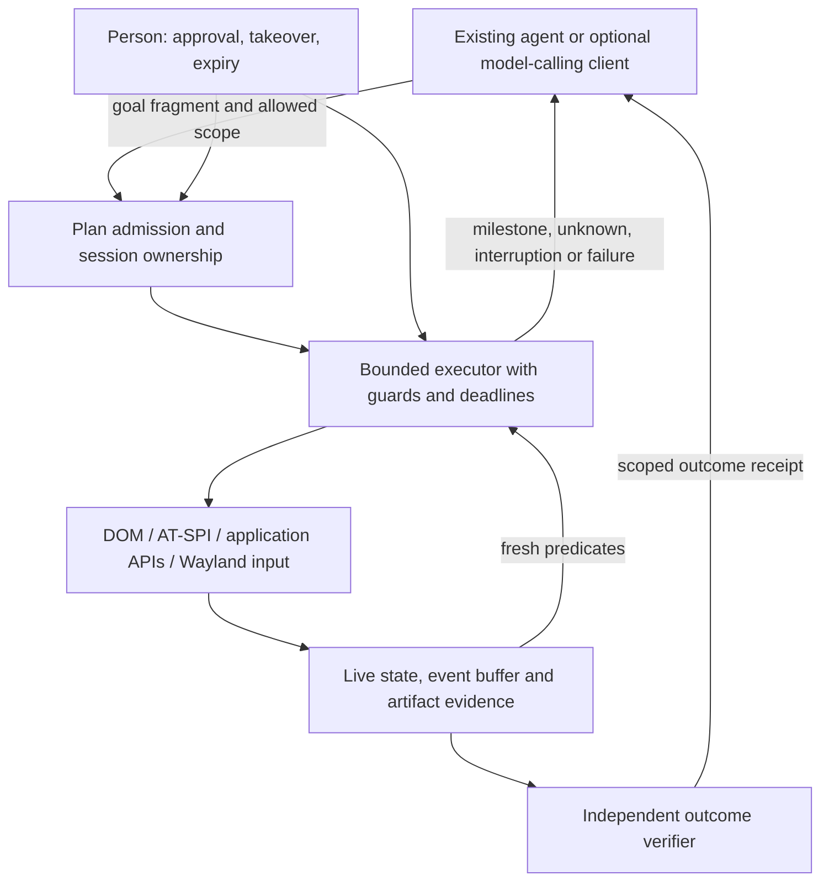

# Agent Desktop research review — 2026-10-09

Read-only research completed against the checkout initially at `4b4410125b2305d00d2668bcfcd6d950c4313752`. No tests, benchmarks, agent runs, desktop sessions, installations, or state-changing Git commands were executed. Only this report was written, beginning with a skeleton. Another contributor is working in the checkout; line references describe the files inspected, not a promise about later revisions.

Evidence labels: **code finding** = static inspection, not runtime reproduction; **recorded result** = existing repository experiment, not rerun here; **documented external result** = the source author's claim; **proposal/inference** = a design or prediction to test. None of the proposed experiments below was executed. Public sources were checked on 2026-10-09. Literature review depth ranges from abstracts to selected full texts and published source; this is not a systematic review or reproduction.

## Summary: the five most important findings

**1. Keep the objective, change the first experiment.** Fewer model decisions are the right target, but the plan bundles act-and-observe with a new capture backend, visual deltas, noise masks, and token optimization. First combine an action or short sequence with a bounded observation using existing frame capture; then add precise targets and postconditions. Existing raw-frame differences and screenshot replies already supply most of that plumbing (`src/agent_desktop/worker.py:832–951`; `src/agent_desktop/mcp_server.py:316–332`). The host trace supports a possible reduction in separate screenshot calls, not a measured 32% latency improvement or a universal model-time fraction: the earlier note includes shell work and human pauses (`docs/research/2026-10-09-speed.md:14–27`). Damage-based capture should earn its priority after this smaller experiment.

**2. The binding constraint is trustworthy local checks, not the length of a queued plan.** Present waits can join a window in one application with an element from another, silently incomplete AT-SPI reads can look complete, and a file deletion can satisfy the current file-event wait (`core.py:711–737`; `atspi.py:225–252`; `effects.py:545–563`, all under `src/agent_desktop/`). More seriously, experimental `desktop_set` writes outside the worker's lease and human-takeover gates (`mcp_server.py:168–180` versus `worker.py:1287–1289,1337–1350`). Fix these foundations before expanding automation. A successful dispatch, quiet image, matching phrase, and verified user outcome are different observations.

**3. Move small reusable procedures and private browser control ahead of general crawling.** The atlas demonstrates a narrow, valuable shortcut, but independent verification from default profiles does not establish safe composition or transfer. Two Mousepad plugin controls overwrite the same list, and Geany controls overwrite a shared bitfield; `atlas.apply` writes the stored destination literally (`src/agent_desktop/atlas.py:138–162`; `docs/research/2026-10-09-effect-atlas.md:105–110`). Prefer three useful, parameterized procedures with clean-state admission checks, fresh selectors, and independent output verification. Broad navigation maps, racing sessions, and speculative mutations have weaker gain-per-effort and should be cut from the near-term critical path.

**4. Astra's 1.9× claim is verified; its causal decomposition is not public in the sources inspected.** The [official announcement](https://openai.com/index/gpt-6-astra/) attributes the Mind2Web result to the model and updated Codex harness together, relative to the GPT-5.6 Sol experience. Public documentation supports code-based grouped execution, structured action batches, and explicit observation policies; published code supports persistent browser execution and configurable image preparation. None proves which change produced that benchmark gain. Agent Desktop can supply guarded execution and compact evidence to MCP clients; model scheduling, cache reuse, context retention, and inference speed remain partly or entirely client/provider responsibilities.

**5. A credible 10× design executes bounded task programs and reports checked milestones.** It does not make the model reconstruct a video from a long sequence of crops. Maintain current state and evidence locally, execute approved predictable steps, stop at uncertainty, and call the model at decision boundaries. Tenfold improvement is plausible as a target for repeated, structured workflows—not an established improvement over humans or arbitrary first-use tasks. Everyday value should center on getting useful artifacts out, durable working profiles, interruption/resumption, and short approved interactions with live applications. Existing profiles and handoff are foundations (`src/agent_desktop/core.py:75–178`; `worker.py:1170–1231`), not reasons to build another general agent product.

## Plan critique

The plan reviewed is `docs/research/2026-10-09-beyond-human-speed.md` (abbreviated **speed plan** below). Throughout the report, unprefixed code basenames mean `src/agent_desktop/<basename>`; unprefixed research basenames mean `docs/research/<basename>`. `BENCHMARK.md` means `docs/BENCHMARK.md`.

1. **S1 is too large and optimizes a proxy before isolating the round-trip saving.** The S1 row combines a Wayland backend, fallback diffing, settling, crops, keyframes, masks, and a ≥30% token gate (speed plan:224). `worker.py:905–951` already captures raw frames and computes a changed box, and `worker.py:964–979` already has bounded quiet waiting. The MCP screenshot response already joins metadata and an image (`mcp_server.py:316–332`). **Change:** split S1 into S1a action-plus-observation with existing capture, S1b precise semantic observations, and an optional later capture optimization. Use independent outcomes, model turns and wall time as S1a's primary measures; hold image policy fixed in the first comparison. A changed crop should be an output option, not an obligatory precondition for batching.

2. **The timing premise needs tighter wording and better accounting.** Speed plan:11–17 equates almost all outside-tool time with agent decisions and says faster capture/input cannot help. The source note explicitly includes shell/read time and human pauses (`2026-10-09-speed.md:20–24`). The worker trace starts within the worker and finishes before reply transmission (`worker.py:1596–1598,1624–1640,1653–1686`), so it does not measure all CLI startup, transport, serialization or client image handling. A median inter-call gap is not mean inference latency. With an actually accelerated fraction f=0.004–0.026, eliminating that fraction alone gives only 1/(1−f)=1.004–1.027×; this is an illustrative Amdahl bound, conditional on that accounting. Removing 53 of 164 calls would give 164/111≈1.48× only if each removed call would otherwise force an equally costly serial decision. **Change:** distinguish tool calls, model turns, app waiting, human waiting, model time and transport; state that the traces establish the priority, not the predicted speedup. Record p50/p95 and total attempted-task time, not just medians of call gaps.

3. **Damage is a repaint signal, not a readiness oracle.** The protocol's `copy_with_damage` waits for damage; it does not attest that application work is complete. A failed input can leave the image perfectly still; a network response can arrive after a quiet interval; a spinner can continue after the needed control is ready. Damage can include pixels redrawn identically. Speed plan:64's “precise settled signal” is therefore too strong. The existing `settle` also returns when its limit expires without indicating why (`worker.py:964–979`), and its docstring's assertion that settling shows text was handled is stronger than the mechanism. **Change:** return separate `visually_quiet`, `predicate_satisfied`, `deadline_reached` and coverage fields. Use damage to wake a semantic recheck, with a deadline and explicit unknown; never use masked visual quiet alone to authorize the next consequential step. [wlr protocol](https://wayland.app/protocols/wlr-screencopy-unstable-v1), [ext capture protocol](https://wayland.app/protocols/ext-image-copy-capture-v1).

4. **S2 assumes stronger predicates than the current code supplies.** In `core.wait`, names/text are substring matches; no enabled, checked or exact-value test exists (`core.py:703–709`). Window matching uses `app_id`, but element traversal only receives `window=title`; `app_id` does not constrain it (`core.py:711–737`). Thus “app A exists” and “Saved exists” can both hold without Saved belonging to A. `atspi.tree` skips node/application read failures without marking coverage incomplete (`atspi.py:225–230,245–252`), so `gone` can be falsely established despite the truncation safeguard (`core.py:732–735`). `atspi.py:16–26` omits enabled/sensitive/busy states. **Change:** make exact, unique, app/window/ancestor-scoped selectors and three-valued checks a prerequisite to S2. Carry traversal errors and scope identity explicitly; add actionability states. Resolve and check at dispatch time, not once when constructing the plan. Do not label the existing `check()` “one consistent look” (`core.py:712`) as an atomic snapshot: it makes separate requests while apps can change.

5. **“Stop on surprise” currently means a narrow inter-step check, not expected-transition validation.** `run_steps` unconditionally accepts the new observation after every action (`core.py:890–899`). An unexpected window appearing before this refresh can become the next accepted baseline. The token excludes session ID, geometry, titles and pixels (`worker.py:981–1000`); a semantic node ID is just a cached bus-name/path mapping (`worker.py:766–778,1433–1444`), not an element generation guarantee. S2 correctly proposes `expect`, but should not describe the existing baseline as almost equivalent. **Change:** require both postconditions and frame conditions (“these relevant facts must remain unchanged”), including target identity/modal scope. Separate `dispatched`, `observed`, `contradicted`, `unknown` and `not_attempted`; preserve the present `DeliveryUnknown` stop without retry (`core.py:874–879`). Put one deadline on the whole plan as well as per-step limits, and cap branch depth and observation work.

6. **Make every mutation use the same ownership gates before adding API shortcuts.** `desktop_set` reads the manifest, checks host mode, and writes directly (`mcp_server.py:168–180`). It never calls the worker that enforces lease ownership and human control (`worker.py:1048–1068,1337–1350`). It can therefore attempt private-profile writes during takeover or from a competing controller; this is a code-path finding, not a reproduced incident. `atlas.apply` also takes the first match and writes keys sequentially without validating current source values (`atlas.py:142–162`). **Change:** move application-setting writes into the worker's mutating-operation path, validate readiness and allowed paths, prevalidate the entire update, and produce an outcome receipt. Apply the same rule to future DOM, D-Bus and file adapters. A shortcut is not exempt from takeover because it does not use the pointer.

7. **S3 mixes an urgent host-control issue with an optional OCR project.** Current host activity detection uses seat idle/resume timing and excludes intervals attributed to agent input (`worker.py:440–454`; `wayland.py:638–672`). Faster continuous batches make that heuristic less suitable as a human-priority mechanism. `UserActive` raises without bumping the epoch or requiring a fresh observation (`worker.py:1282–1286`), and the handler has no lock/layer-focus check before input. An idle inhibitor now exists (`worker.py:417–431`); it is not lock awareness. **Change:** move lock/overlay refusal, fresh observation after human activity, and cancellation responsiveness into a host prerequisite stage. Until those are validated, develop long plans only in private sessions. OCR can wait. The S3 criterion “accuracy ≥95%” (speed plan:226) is unsuitable for autonomous multi-step dispatch: under a simplistic independent-error model, 0.95^20≈36% of 20-step trajectories are all correct. Measure accepted-target precision, abstention/coverage, wrong-window clicks and recovery separately, with independent postchecks. Zero errors in a small sample is not proof of safety.

8. **Move the private part of S4 earlier; separate it from personal-browser integration.** Private browser tasks can use DOM locators and browser events without solving general OCR or native-widget geometry. Firefox's documented BiDi startup is explicit and browser-owned; it is not a generic way to attach to an arbitrary already-running instance. The runtime already pins private Firefox profiles (`worker.py:650–679`). **Change:** prototype one private browser adapter alongside S2, comparing browser-native actions with the current pixel/AT-SPI path on the same task. Keep extension installation, personal-profile access and host browser restarts as separate, explicitly approved work. DOM readiness is not remote transaction success; verify durable effects where available. [Firefox connection documentation](https://developer.mozilla.org/en-US/docs/Web/WebDriver/How_to/Create_BiDi_connection), [Remote Agent security](https://firefox-source-docs.mozilla.org/remote/Security.html).

9. **S5's general map is the weakest research bet.** A structural fingerprint is not a sufficient state: two identical dialogs may refer to different documents, accounts, clipboard values, pending requests or unsaved content. A full tree hash creates the opposite problem—every dynamic label is a new state. The earlier finite abstraction example itself retained 94 of 128 states when preserving outcomes/transitions (`docs/research/abstraction-experiment.json:11,61–71`); it is only a toy, but usefully illustrates the tradeoff. Generic breadth-first exploration (speed plan:128–138) will face huge branching, invalid resets, hidden state and expensive verification. **Change:** build a task-conditioned route cache from successful traces and a few safe discovery actions; record known/unknown edges, evidence, expiry and applicability. Retrieve a useful subgraph, not “the whole app.” Optimize expected latency plus recovery and risk, not raw edge count. Defer broad crawling until three recurring tasks show missing navigation knowledge is their actual bottleneck. [R-WoM](https://arxiv.org/abs/2510.11892) independently motivates skepticism about long-horizon predictions; it is not a guarantee for our map design.

10. **Atlas composition must precede desired-state automation.** Exploration verified controls individually in fresh default profiles (`2026-10-09-effect-atlas.md:63–73`), and the artifact stores absolute destinations. Mousepad's Shortcuts Editor and Spell Checking each set a singleton `enabled-plugins` list (`docs/research/effects/atlas-mousepad-20261009.json:673–720`); Geany auto-close controls share `autoclose_chars` (`2026-10-09-effect-atlas.md:107–110`). Applying those literals sequentially overwrites the first choice (`atlas.py:156–161`). `desktop_set` has no desired boolean/value argument (`mcp_server.py:168`), so it is an apply-recorded-transition tool, not general “set this setting.” **Change:** retain source-state assumptions, learn or hand-author field/bit/list update semantics, validate versions and live adoption, and check preservation of unrelated settings. Begin with scalar keys and reject overlapping writes that lack compositional semantics. Do not infer a reusable state transformer from one before/after pair.

11. **Move a small S6 procedure pilot ahead of S5; do not auto-promote one lucky success.** Speed plan:149–150 treats a completed plan or verified trace as a procedure. That trace may overfit coordinates, data and a transient notification. Current traces intentionally omit typed content and command arguments (`worker.py:242–259,1653–1686`), so they cannot reconstruct arbitrary programs. **Change:** start with explicit parameters and a restricted procedure language; record demonstrations only by opt-in, outside credential entry. Require clean-state replay and independent output checks before admission, then a held-out input/layout trial. Store only procedures that repay their authoring/maintenance cost. [PreAct](https://arxiv.org/abs/2606.17929) makes clean-state store-time verification a central mechanism and reports 8.5–13× faster repeats; that is useful prior art, not our expected general speedup. Offering a matching procedure is worth testing, but the SMC paper's poor macro selection result is specific to its studied system, not all clients.

12. **Cut speculative mutation and racing from the near-term plan.** A throwaway graphical session is not a disposable world. Applications still access host files and network (`README.md:16–18`; private environment construction `worker.py:488–626` does not create a filesystem/network sandbox). Copying a profile can retain access to the same remote account. A destructive-name blacklist (speed plan:130–132) cannot establish absence of side effects. **Change:** limit automatic exploration to allowlisted local fixtures or genuinely disposable application data with known effect boundaries; do not clone personal profiles. Speculate only on read-only observations at first. Independent sessions may run disjoint approved tasks, but two sessions must not race the same external write. The cited [Speculative Actions](https://arxiv.org/abs/2510.04371) and [SMC](https://arxiv.org/html/2609.03236v1) rely on assumptions about draft state and committing results that our runtime does not provide; SMC explicitly trades strict losslessness for approximation.

13. **Fix S1's accounting and synchronization model before treating crops as a codec.** The width×height/750 estimate (speed plan:67–70) is a provider/model-specific heuristic, not a universal image-token law. Tiny crops can incur minimum/patch costs; many crops can cost more than one containing rectangle. Prefix caching is conditional and does not eliminate context-window occupancy or all attention/latency costs. The existing image token carries crop origin/scale but no content revision (`worker.py:981–1009`; screenshot token emission `worker.py:889–895`). **Change:** attach base revision, new revision, coordinate transform, modality coverage, checksum and resync instructions. Maintain reconstruction in software; send a self-contained current semantic view or crop, not an arbitrarily long model-side delta chain. Keep periodic/key-event full views and protect task-critical regions from learned noise masks. Measure actual billed token categories and fallback turns per model. [OpenAI vision](https://developers.openai.com/api/docs/guides/images-vision), [Claude vision](https://platform.claude.com/docs/en/build-with-claude/vision), [prompt caching](https://developers.openai.com/api/docs/guides/prompt-caching).

14. **The gates need first-use, reliability and amortization tracks.** “Equal success” on the already saturated standard suite cannot show that longer batches are safe (`docs/BENCHMARK.md:102–108`). Fewer tokens did not consistently mean faster tasks: the recorded Thunar arm used fewer input tokens and calls but median time rose 35.1→37.4 seconds; the CSV arm used more tokens/calls and rose 48.7→72.6 (`docs/research/effects/agent-ab-20261008.json:129–187`, round3 summaries). **Change:** counterbalance paired arms, preserve failed/time-out attempts, keep model/schema/cache/version fixed, and report cluster-aware uncertainty. Separate first-use time (including discovery), warm reuse time, human involvement and machine-active time. Include duplicate labels, wrong documents, stale nodes, delayed modals, lost replies, disappearing targets, deleted output files and failed accessibility reads. Use independent artifact/remote-state verifiers; count wrong actions even if the task eventually passes. Cut human-speed claims until there is a matched human baseline. Any later paid-model experiment still needs its authorized scope; the historical plan's delegation paragraph does not authorize experiments in this read-only review.

Recommended order: **ownership/observation prerequisites → S1a act-and-observe → exact predicates and minimal S2 → private-browser S4 plus three checked procedures → semantic/event deltas if useful → optional damage backend/OCR → narrowly justified maps**. Keep host hardening separate from speed gains. Defer generic navigation crawling, general world-model training, automatic procedure induction at scale, hidden-monitor workarounds, speculative mutations and race-to-finish execution.

## Ideas ranked by expected gain per effort

Ranking is engineering judgment for this repository, not measured performance. Effort: **S** ≈ 1–2 focused days; **M** ≈ several days to two weeks for a bounded prototype; **L** = substantial compatibility/research work. Experiments are proposals for later authorization, using private sessions and disposable task data unless stated otherwise. File references identify existing integration points; new modules are explicitly marked proposed.

| id | idea | expected gain (source or reasoning) | effort | risk | fit with our code (files to change) | smallest experiment and success criterion |
| --- | --- | --- | --- | --- | --- | --- |
| I01 | Action/short-plan plus final observation | Removes a separate look call when it would force another model turn; 53/59 screenshots followed inputs in the recorded trial | S | Returning too soon; adding waits to every no-op | `core.py:791–899`, `worker.py:832–979`, `mcp_server.py:243–260,316–332` | Three task shapes, fixed full-image policy; ≥20% fewer model turns and lower median active time, unchanged independent completion, no new wrong actions in fault cases |
| I02 | Exact scoped queries and field projections | Avoids 10–13K-character listings already recorded in `BENCHMARK.md:307–313`; restores missing observation-first work | M | Incorrect scope or false completeness | `atspi.py:120–160,189–271`, `core.py:703–737`, `mcp_server.py:264–279` | Query value/enabled/unique target in two apps with duplicate names and failed reads; ≥50% fewer returned characters and no false “absent” or wrong-app match |
| I03 | Desired-state primitives: ensure value/checked, fill fields, select item | Removes focus/type/check micro-decisions; combines grounded targets with runtime verification, following locator/actionability principles | M | GUI handlers can still trigger external effects; ensure is not universal idempotence | `core.py:778–899`, `atspi.py:273–314`, `worker.py:1425–1456` | One form with re-rendering and disabled fields; one call completes predictable portion, stops before commit, and verifies exact values |
| I04 | Bring atlas writes under control gates; live adoption and compositional updates | Prevents invalid shortcuts; live confirmation addresses the atlas's unnecessary verification turns | S/M | Overwriting lists/bitfields, stale app version, concurrent app writes | `mcp_server.py:168–180`, `atlas.py:118–162`, `worker.py:1048–1068,1337–1350` | Two scalar settings plus overlapping plugin/bitfield entries; refuse during takeover/other lease, preserve unrelated values, label restart-needed separately |
| I05 | Private browser semantic adapter | Can remove navigation/grounding turns on a large everyday workload; explicit browser state is cheaper to query than repeated screenshots | M | Broad browser privileges, stale DOM, cross-tab confusion | `worker.py:650–679`, `mcp_server.py:141–147`; proposed `browser.py` | Local form/download workflow in private Firefox; fewer model turns at equal outcome, no wrong-context action, no personal profile access |
| I06 | Three hand-authored checked procedures with admission verification | Large warm-run gain is plausible; PreAct documents fast repeated execution, while this avoids a universal learner | M | Overfitting, missing parameters, poor reuse economics | `core.py:791–899`, `effects.py:497–563`; proposed `procedures.py` | Import/export, editor save-as, browser download; ten varied inputs, zero false-success or uncertain-step retries, ≥2× warm-run speed, report authoring time separately |
| I07 | Long-text insertion with explicit session clipboard ownership or semantic set-text | 1,000 keys currently entail ≈8 s of pacing alone (`wayland.py:41,485–489`); task-specific execution can matter after batching | S/M | Clipboard clobber, formatting changes, password capture | `wayland.py:494–505,616–635`, `atspi.py:291–301`, `mcp_server.py:335–341` | Private editor 1K/10K Unicode payloads; byte-exact saved output, clipboard policy preserved, ≥4× insertion speed; do not remove safe key pacing globally |
| I08 | Artifact manifest and independent targeted verifiers | Ends screenshot-based guessing about saved files, formulas and downloads; builds on demonstrated ledger usefulness | M | Truncated summaries mistaken for full verification | `effects.py:94–150,172–185,497–563`, `core.py:934–951`; proposed artifact adapter | Verify file exists, parse succeeds, requested content and unrelated invariants hold; reject deletion, wrong file, partial save and misleading toast |
| I09 | AT-SPI event cache with periodic reconciliation; Collection queries where supported | Avoids repeated per-node D-Bus traversal; event signals support cheap local checking ([AT-SPI](https://docs.gtk.org/atspi2/class.EventListener.html)) | M | Dropped/coalesced events, recycled objects, toolkit variation | `atspi.py:105–160,189–271`, `worker.py:766–788` | One GTK form and one browser page; narrower tree work and lower query latency, correct resync after event loss/restart; unknown on unsupported Collection |
| I10 | Client cache/context contract and small stable tool surface | Cuts repeated context exposure without gratuitous prefix invalidation; benefit depends on client behavior | S/M | Cache misses or loss of task constraints after compaction | `mcp_server.py:14–71,156–279`; client integration outside runtime | Compare stable schema/instructions + compact current state against current history; record cached/uncached/write/output counters and time per verified task |
| I11 | Observation ring buffer and task-relevant event history | Captures transient dialogs/toasts during model latency; AOI studies the blind intervals between actions | M | Noise, sensitive retention, observation during takeover | `worker.py:936–951,1556–1642`, `effects.py:459–543`; proposed bounded event store | Synthetic 200 ms toast while client is absent; later query recovers event/time without streaming every frame to the model; buffer pauses under existing takeover rules |
| I12 | Adaptive execution horizon and receding-horizon guards | Amortizes planning when predictable while returning early at uncertainty; robotics RTC supplies an analogy, not a drop-in algorithm | M | Bad confidence calibration or stop arriving too late | `core.py:845–899`, `worker.py:1260–1350`; proposed plan policy | Compare fixed 1/5-step batches with guard-coverage-based horizons on interrupted forms; lower turns without more wrong actions; stop before unknown branch |
| I13 | Task-conditioned state/route memory with counterexample refinement | Retains useful navigation without exhaustive BFS; R-WoM suggests retrieved knowledge helps but long simulated plans degrade | M | State aliasing, stale version/locale | `atlas.py:69–115`, `core.py:791–899`; proposed route store | Save three scoped routes; new document/modal must either match valid preconditions or cause abstention; improve repeated time including lookup overhead |
| I14 | Local grounding cascade: semantics → OCR/template → optional pretrained grounder → model | May eliminate some frontier visual calls; SeeClick/UGround/UI-TARS demonstrate grounding specialization | M | Small icons, duplicate text, memory/latency on this laptop | `worker.py:832–951`, `atspi.py:120–160`; proposed `grounding.py` | Label existing non-sensitive recorded frames with duplicate/no-target cases; measure precision at accepted coverage and p95 local latency; no dispatch experiment until abstention works |
| I15 | Native capture with coalesced damage and revisioned crops | Saves polling/copy work and enables event observations; no direct 10× wall-time case from current host timings | M | Buffer/protocol complexity, overdamage, transform errors | `wayland.py:48–161`, `worker.py:832–979` | Recorded-frame/backend comparison later; correct pixels/transforms, cancellation/no-change deadline, lower CPU and no worse readiness; retain grim fallback |
| I16 | Reviewable task workspace with conflict-aware export | Large usefulness gain: user receives checkable artifacts while original files remain recoverable | M | “Undo” overclaim; originals change concurrently | `effects.py:94–185,240–264`, `core.py:244–381`; proposed task workspace module | Work on selected copies, review cell/text diffs, promote only when original hash matches; deliberate conflict must block overwrite |
| I17 | Bounded observation streaming with latest-state backpressure | Avoids stale-observation queues while models are slow; event summaries and resync borrow from RFB/stream systems | M/L | Requires client support; image compression may save bytes but no tokens | `mcp_server.py:87–103,316–332`, `worker.py:936–951`; proposed client adapter | Slow consumer receives current revision plus important transient events, not 100 stale frames; preserve all declared stop events |
| I18 | Compositor evidence adapter, then private transient-seat experiment | Potentially improves target geometry/focus ownership; transient seats exist in protocol, implementation support unverified | L | App multiseat behavior, compositor coupling; no host authorization shortcut | `wayland.py:88–100,141–161,523–601`, `worker.py:981–1009` | First inspect advertised capabilities in a future private test; refuse absent capability; only continue if a private fixture demonstrates independent focus and correct targeting |

The first six ideas are the near-term program. I07–I11 are valuable small extensions when an actual task calls for them. I14–I18 should not delay the first measured reduction in model turns. No training of a frontier model is proposed.

## Research connections that change the design

These are mechanisms to borrow, not benchmark numbers to transplant.

- **Latency and decision boundaries.** [OSWorld-Human (2025; revised 2026)](https://arxiv.org/abs/2506.16042) decomposes agent latency and reports substantial planning/reflection overhead and excess steps. [AAPT (2026)](https://arxiv.org/abs/2607.28399) precomputes bounded action branches for transient opportunities; its reported improvement in those opportunities is not a general task-speed multiplier. For Agent Desktop, this argues for a tiny set of explicit anticipated branches—dialog present/absent, target ready/not ready—with deadlines. It does not justify letting an unbounded script infer new goals locally.
- **Motor programs and model predictive control.** [Real-Time Chunking (2025)](https://arxiv.org/abs/2506.07339) overlaps robot inference with execution while retaining a committed action prefix. Its flow-policy method is not directly portable to discrete GUIs. The useful analogy is to commit only a short validated prefix, monitor relevant state, and replan at an uncertainty boundary. Speculatively computing the next plan is safer than speculatively clicking; discard the plan if its observation revision no longer matches. Async inference also needs a cancellation-aware client and can increase cost.
- **World models should begin as empirical task memory.** [R-WoM (2025; revised 2026)](https://arxiv.org/abs/2510.11892) finds limited longer-horizon GUI prediction and benefits from retrieved knowledge in selected settings. Start with observable preconditions, action, expected effects, counterexamples and expiry. A screenshot embedding or tree hash alone does not identify task state. Refine a stored route when two apparently identical states produce different outcomes; include only the extra distinguishing facts needed by that task. This is a proposed lightweight abstraction method, not a learned universal simulator.
- **Demonstration-to-program synthesis needs admission and economics.** [PreAct (2026)](https://arxiv.org/abs/2606.17929) provides the most directly relevant procedure-store idea: compile and verify before reuse. [Speculative Macro Composition (2026)](https://arxiv.org/html/2609.03236v1) suggests useful macros can be missed even when exposed as tools. Retrieve at most a few applicable candidates, with parameters and preconditions, instead of growing the tool schema indefinitely. Begin with hand-authored procedures; add opt-in demonstrations only once execution and verification are sound. A procedure is worthwhile after roughly `authoring_cost / (first_principles_cost − reuse_cost)` uses, adjusted for failures and maintenance. One-off personal tasks may never cross that threshold.
- **Grounding is a selective prediction problem.** [SeeClick (2024)](https://arxiv.org/abs/2401.10935), [UGround (2024)](https://arxiv.org/abs/2410.05243), and the [UI-TARS repository](https://github.com/bytedance/UI-TARS) support specialized grounding as a real option. None establishes acceptable latency or precision on this laptop. Evaluate existing weights only after exact semantics and cheap OCR/template methods; include “no such target,” repeated labels, mixed scaling and modal occlusion. Calibrate acceptance by target class and consequence. A grounder locates a candidate; it does not authorize the action or prove its effect.
- **Observation is a stream; the model need not consume a stream.** [Agent-Computer Observation Interfaces (2026)](https://arxiv.org/abs/2606.29472) addresses information missed between actions. Its ablations favor persistent narration over keyframe-selection sophistication, and extra image streams can regress on some models. Locally capture bounded relevant events during inference, then give the model current state plus important transients; begin with deterministic semantic event summaries before adding model-generated narration. Borrow baseline IDs, rectangle updates and resynchronization from [RFB](https://datatracker.ietf.org/doc/html/rfc6143). Video/interframe compression primarily reduces bytes; independent image inputs do not automatically inherit those savings. Coalesce stale frames, retain declared stop events, and reset after takeover or output changes. Full images at decision boundaries may outperform many tiny deltas.
- **Accessibility and testing supply practical machinery.** [AT-SPI event listeners](https://docs.gtk.org/atspi2/class.EventListener.html) and [Collection queries](https://docs.gtk.org/atspi2/method.Collection.get_matches.html) are candidates for local state maintenance, subject to app support. [Playwright locators](https://playwright.dev/docs/locators) resolve fresh elements; [actionability](https://playwright.dev/docs/actionability) separates readiness checks from dispatch. [GraphWalker's state/edge models](https://graphwalker.github.io/graphwalker-rs/model-based-testing) suggest generating interruption and negative-path tests from the same restricted procedure model. Borrow those validation methods for ordinary user tasks; do not make graph coverage the product objective. Polling a read-only condition is acceptable; retrying a mutation with unknown delivery is not.

## Question 3: what the public Astra/Codex evidence establishes

### The 1.9× result and its limits

**Documented:** OpenAI's announcement reports 1.9× faster Mind2Web task completion for Astra plus an updated Codex harness versus the existing GPT-5.6 Sol experience. It changes model and harness together. **Not verified:** an ablation, the exact benchmark harness revision, batch lengths, screenshot frequency, image resolution, cache-hit rate, reasoning budget, or a latency breakdown for that comparison. The announcement's separate OSWorld performance/latency discussion is not a decomposition of the Mind2Web result. [Official announcement](https://openai.com/index/gpt-6-astra/).

The public [Codex changelog](https://learn.chatgpt.com/docs/changelog) and the inspected source paths below provide capability evidence; they do not identify the measured Mind2Web implementation. A sample application is particularly weak evidence for production defaults. No undocumented implementation is assumed here.

| Candidate mechanism | Documented fact or public code | What can be inferred about the 1.9× result? | Agent Desktop / MCP versus harness |
| --- | --- | --- | --- |
| Action batching and local branching | The computer-use guide recommends code execution for Astra; scripts may combine actions, loops and conditions. The structured computer interface also supports ordered actions followed by an observation. [Guide](https://developers.openai.com/api/docs/guides/tools-computer-use) | A credible way to remove round trips; contribution to the benchmark is unknown | Server can expose bounded plans and action-plus-observation. Client must choose/use them and avoid forcing a model response between their steps |
| Persistent browser execution and semantic grounding | The official sample's `exec_js` uses a persistent Playwright environment, exposes browser/context/page and recommends locator-based readiness. [Pinned sample, lines 122–148](https://github.com/openai/openai-cua-sample-app/blob/f2a3dc523ae406f9b704f9a420a05402a63b4522/javascript-app/src/responses-loop.ts#L122-L148) | Demonstrates an available mechanism, not that Mind2Web used it | A private browser adapter can provide this through MCP; no new frontier model is required. Arbitrary code is not necessary for a restricted plan API |
| Screenshot policy | The guide's example observes before acting and after a short group; it keeps screenshots in memory. [Guide](https://developers.openai.com/api/docs/guides/tools-computer-use) The sample captures an audit screenshot after execution but returns execution output; audit capture is not proof that every captured frame is sent to the model. [Sample, lines 150–156](https://github.com/openai/openai-cua-sample-app/blob/f2a3dc523ae406f9b704f9a420a05402a63b4522/javascript-app/src/responses-loop.ts#L150-L156) | Supports deliberate observation scheduling; exact benchmark policy unknown | Server can return chosen evidence with actions; client controls which images/history enter the next model request |
| Image format, detail and preparation | Codex's `view_image` selects detail according to arguments, model capabilities and feature flags. Image preparation distinguishes detail-based and unified-budget modes. [Handler, lines 133–198](https://github.com/openai/codex/blob/d3f9b22b745602cb6b46e436e0ed8302a40c1fdf/codex-rs/core/src/tools/handlers/view_image.rs#L133-L198), [preparation, lines 39–95](https://github.com/openai/codex/blob/d3f9b22b745602cb6b46e436e0ed8302a40c1fdf/codex-rs/core/src/image_preparation.rs#L39-L95) | Shows model-aware preparation, not a temporal delta codec or the settings used in Mind2Web | Server can provide crops, dimensions and transforms. Client/provider owns final resizing, detail and image-token treatment |
| Grounding quality from the model | The announcement reports improved computer-use performance, but supplies no isolated grounding-latency ablation. [Announcement](https://openai.com/index/gpt-6-astra/) | Fewer mistakes could reduce turns; **inference**, not demonstrated causality | MCP can provide stronger target evidence. It cannot make arbitrary clients inherit Astra's learned capabilities |
| Prefix caching and context management | Repeated exact prefixes can receive prompt-cache reuse; tool definitions and image inputs participate under the documented rules. [Caching guide](https://developers.openai.com/api/docs/guides/prompt-caching) | Helpful generally; no verified benchmark cache policy or cache contribution | Server can keep schemas stable and observations compact. Client orders/retains context; provider determines hits and inference performance |
| Persistent model transport | Responses WebSocket mode uses a persistent connection and incremental input; OpenAI reports up to roughly 40% faster execution in some 20+ tool-call rollouts. [WebSocket guide](https://developers.openai.com/api/docs/guides/websocket-mode) | A separate reported result, not attributable to this Mind2Web comparison | A model-calling client can use it; an MCP server cannot select the upstream model transport for every client |
| Faster inference, reasoning policy, scheduling | No inspected source isolates these variables for the stated comparison | All remain possible contributors; no numerical allocation is justified | Primarily model/provider/harness responsibilities |

**Practical transfer:** implement a small `observe`/`execute_plan`/`procedure` contract with explicit sessions and verified stop conditions. Keep model calls outside the core runtime. Offer a reference client later to demonstrate cache-conscious history, persistent transport, image selection and interruption. MCP portability provides capabilities; it cannot guarantee that every connected model or harness uses them efficiently. The current server instruction explicitly encourages screenshot → action → screenshot (`src/agent_desktop/mcp_server.py:14–17`), so a new combined tool needs matching usage guidance, not just an additional endpoint.

For a later causal comparison, vary one axis at a time: current versus grouped actions at fixed observations; full images versus semantic/crop observations at fixed action policy; then context/cache and transport at fixed model. Record success and wrong actions alongside turns, input/cache/output usage and p50/p95 elapsed time. Keep model changes in a separate comparison. None of those experiments was run for this review.

## Question 4: a design aimed at 10× improvement

**Proposal, not measured result:** make Agent Desktop an executor of bounded, observable task programs, with an optional client that calls a model only when a genuine choice remains. Preserve its role as infrastructure for existing agents.

### Runtime and protocol

1. **One mutation authority.** Every GUI, DOM, setting and document action passes through the same session controller. Each admitted plan names the session, current control epoch, target scope, expected state, deadline, allowed branches and consequential boundaries. Recheck ownership/expiry/takeover before each step and during interruptible waits. Observation during human takeover retains the existing restrictions; a new cache must not bypass them. The current worker is the natural enforcement point (`worker.py:1260–1350`); the direct atlas path must move there (`mcp_server.py:168–180`). Serialize plans per session/controller, not merely socket messages: current MCP tools are dispatched to threads (`mcp_server.py:87–103`), while a plan is multiple requests (`core.py:845–899`), so concurrent calls by the same controller can interleave between steps. This is a static possibility, not a reproduced race.
2. **State service with provenance.** Maintain window identities, scoped semantic properties, selected browser context, output transforms, recent relevant events and file versions. Every view records source, timestamp, coverage and revision; absence is only asserted within a complete scope. Reconcile event caches periodically and after restart. The model receives a self-contained task view and optional crop; it does not maintain the authoritative UI state. Extend current observation guards and frame caching (`worker.py:936–1009`) and accessibility traversal (`atspi.py:189–271`), rather than treating those as an atomic snapshot already.
3. **Restricted plans before arbitrary code.** A first interpreter needs sequence, bounded wait, exact target, ensure-value, allowed branch and stop. Return per-step evidence and partial progress. A failed read can be repeated; an uncertain write is never repeated automatically. Browser/AT-SPI actions should express desired state where possible; pointer/keyboard remain fallbacks. Current `DeliveryUnknown` handling is a useful invariant to preserve (`core.py:874–879`). Arbitrary scripts could later run only behind the same broker and an actual containment design; the private compositor alone is not that containment (`README.md:16–18`).
4. **Durable execution receipts.** Give each plan and step an operation ID and journal whether it was admitted, dispatched, observed or left unknown. Reconnection queries status instead of replaying input. A crash between dispatch and recording remains unknown; a journal cannot conjure exactly-once external effects. Use a remote idempotency key only where the application actually supports it. The current trace is useful diagnostic metadata (`worker.py:1653–1686`), and the ledger supplies local effects (`effects.py:497–543`); neither is yet this protocol.
5. **Procedures as small verified programs.** Store parameters, selectors, version applicability, preconditions, expected effects, preservation checks, evidence and expiry. Admission requires clean disposable replay and an independent verifier. At runtime, execute only the prefix whose guards are established; return the rest to the agent. Prefer a handful of common tasks over exhaustive maps. Counterexamples should invalidate applicability rather than silently expand the script.

### Compositor and model-calling changes

Keep labwc initially. Native damage capture is useful for an event-driven state service, but the bigger compositor opportunity is **evidence about targeting**: stable surface identities, geometry/transforms, active seat focus, modal/layer/session-lock status and distinct physical-versus-emulated input attribution. Introduce capability adapters; refuse a capability-dependent action when evidence is unavailable. Current generic toplevel tracking only exposes a narrower title/app/state/parent view (`wayland.py:523–580`), and capture/input assumes one output at scale 1 (`wayland.py:141–161`; `docs/USAGE.md:323–325`). Compositor knowledge still cannot prove that a document was saved or a remote form committed.

An exploratory private backend could evaluate [transient seats](https://wayland.app/protocols/ext-transient-seat-v1) or [libei](https://libinput.pages.freedesktop.org/libei/) for more deliberate input ownership. **Unverified:** suitable support in this installed labwc/Hyprland stack, toolkit behavior and any benefit over current virtual input. These are not an invisible-host-control workaround. A separate seat does not authorize access to the person's screen or defeat takeover. Do not fork the compositor before a smaller capability probe demonstrates a needed feature.

An optional client can keep a stable instruction/tool prefix, retrieve only relevant procedures, compact completed milestones into receipts, and replace stale images with a fresh task view. It can keep model transport open and overlap read-only local observation with inference. A faster/smaller model may handle a known low-ambiguity choice only after calibration; escalation must be explicit. No model training is required. Cached tokens, bytes, number of images and model turns are separate quantities; optimize verified task cost and latency, not one proxy. [Prompt caching](https://developers.openai.com/api/docs/guides/prompt-caching), [WebSocket mode](https://developers.openai.com/api/docs/guides/websocket-mode).

### What “10×” would require

For an illustrative task, let `T = N × L + E + H`, where N is serial model decisions, L their mean latency, E local execution/waiting and H human blocking. Suppose a warm structured workflow changes from `40 × 3 s + 8 s = 128 s` to `3 × 2 s + 6 s = 12 s`: that is 10.7×. **Every number in this example is hypothetical.** It requires reusable local execution, only three decisions, a modest client/model latency improvement and no human interruption. It is not a forecast from the host trace.

Even reducing model time tenfold with a fixed 2% execution fraction yields only `1 / (0.02 + 0.98/10) ≈ 8.47×`. Thus 10× is not obtained simply by batching ten actions. Do not multiply gains from batching, macros and context reduction when they remove the same work. For first-use tasks, include discovery and procedure construction; for authenticated tasks, report human wait separately as well as end-to-end time. Require independent output success, no additional wrong actions, and preserved refusal/uncertainty behavior before calling any speedup useful.

The smallest architecture prototype is still I01–I06: one existing capture path, exact checks, a private browser adapter and three verified procedures. Native compositor integration and continuous client streaming are optional subsequent experiments.

## Question 5: usefulness beyond speed

The highest-value product extension is a dependable path from “do this in my apps” to a reviewable result. These priorities are hypotheses about everyday use, not a user study.

1. **Deliver artifacts, with an intelligible account of what changed.** For documents, spreadsheets, downloads and exports, return the actual output, its location, a concise content diff and verified requirements. Offer working copies and conflict-aware promotion for selected inputs. Existing ODF/text parsing and bounded diffs are a useful base (`effects.py:94–185`), but caps and version eviction (`effects.py:61–66,245–264`) mean “undo everything” would be false. Start with a local text/CSV/ODS workflow, then PDF/export validation. Prefer “these cells and formulas were checked” over “the spreadsheet is correct.”
2. **Make interruption and resumption routine.** Users need to close a viewer, answer a question later, reconnect a client and know what remains. Build task checkpoints around verified effects and unresolved operations, with a short resumable task description. Existing profile state identifies abandoned sessions (`core.py:116–138`), and private takeover increments epochs and requires a new screenshot on release (`worker.py:1170–1231`). Extend these into task continuity without replaying unknown actions. A resumable workflow is often more useful than a faster uninterrupted demo.
3. **Make a durable private workspace easy to understand.** Named profiles already preserve a private home (`core.py:75–81,141–177`); improve the user-facing account/profile identity, task files, storage management and login handoff around them. Let the person sign in through takeover, preserve the resulting approved private profile, and keep credential entry out of demonstrations and observation buffers. Do not copy the person's personal browser profile as a shortcut. Persistence is valuable even when no speed optimization is enabled.
4. **Support deliberate transfer between the person's work and the private desktop.** Add selected-file import, explicit export, and long-text insertion with clear ownership. Existing takeover clipboard clearing protects secrets (`worker.py:1191–1228`); preserve it. Current text input is paced per key (`wayland.py:485–505`), while `clear_selection` is cleanup rather than a general agent paste interface (`wayland.py:616–635`). A bounded private-session paste or semantic set-text operation would improve everyday writing and data entry without removing keyboard pacing globally.
5. **Combine browser-native work with desktop applications.** Research, fill forms, download files, process them locally and upload a selected result through one explicit session/task scope. Start with private Firefox. Later, a separately approved live-browser bridge could make short authenticated interactions practical, without requiring an entire task on the person's visible screen. The runtime currently supplies a private browser profile (`worker.py:650–679`); a browser protocol adapter is proposed, not present. Remote Agent access includes browser secrets, so localhost alone is not a sufficient product permission model. [Firefox security documentation](https://firefox-source-docs.mozilla.org/remote/Security.html).
6. **Prioritize compatibility that blocks real work.** Mixed-DPI/multiple outputs, reliable modal identification, keyboard-layout handoff, file dialogs and long-running application readiness deserve explicit task evidence. Current pointer support rejects anything other than one output at scale 1 (`docs/USAGE.md:323–325`; `wayland.py:141–161`); private handoff has an explicit keyboard argument (`worker.py:1170–1184`). Extend only from reported use cases, with transform/target tests and refusal on ambiguity. These limitations can prevent a task outright; another atlas setting may merely save a few calls.
7. **Offer a small library of useful recipes.** Examples: clean an imported spreadsheet and export a checked CSV; produce a PDF from a document; organize selected downloads; collect information from several pages into a source-linked local report. Each recipe declares inputs, allowed effects, how completion is checked, and where human help may be needed. A recipe can mix application APIs, file operations and GUI actions, all under the same authorization. Do not optimize toward being “GUI-only”; the user wants the result. Do not expand into another general planner, GUI-testing product, unattended account crawler or training platform.

A practical usefulness trial would have the maintainer choose three real recurring tasks, with disposable or selected copies where applicable. Record time saved, interventions, successful resumption, artifact quality and willingness to reuse. That proposed trial is separate from this read-only review and was not performed.

## Contradictions and unsupported claims

“Wrong” below means contradicted by inspected code or unsupported by the cited evidence; historical observations remain valid at their recorded revision.

| Location / claim | Finding and correction |
| --- | --- |
| Speed plan:173–175: private sessions share the person's home/configuration | **Wrong for current private-session defaults.** Worker constructs a private home/profile home and sets HOME/XDG paths (`worker.py:515–526,556–563`). Same Unix user and filesystem access do not imply same effective application configuration |
| Speed plan:11–17: outside-tool time is agent decision time; capture/input cannot help | **Overstated attribution.** The source includes human/shell time (`2026-10-09-speed.md:20–24`); worker trace excludes request/reply overhead (`worker.py:1596–1640`). Prioritize decisions, but measure the components and allow task-specific exceptions such as long text |
| Speed plan:64: damage yields a precise settled signal | **Wrong readiness inference.** Damage reports repaint activity, not semantic completion. Keep visual quiet separate from postcondition evidence; same correction applies to `worker.py:964–979`'s settling docstring |
| Speed plan:67–70: width×height/750 token estimate | **Not portable.** Provider/model/detail-dependent accounting; use observed usage, not a universal formula |
| Speed plan:48–51,202–213: ideal/human timing and 3–10× human speed | **Unverified forecast, not a measured comparison.** No matched human baseline here; the host trial includes different work and human interaction. Label as target and specify workload |
| Speed plan:163–164: pre-executing actions is safe in disposable sessions | **Insufficient condition.** Disposable graphical state does not roll back filesystem/network effects (`README.md:16–18`; `worker.py:488–626`). Require disposable effects/resources, not just a session |
| Speed plan:168–170: background window input cannot work through the screen | **Too universal.** It accurately describes the shared-seat constraint of the current design. Transient-seat protocols provide another possible architecture, but support and application behavior here are unverified. Do not claim practical host background control from protocol existence |
| `README.md:132–133`: input never reaches the physical screen | **Missing approved-host exception.** Explicit host sessions target the person's compositor (`worker.py:417–438`). Say private sessions are isolated graphically, and host access is explicit and expiring |
| `docs/USAGE.md:236` and `mcp_server.py:41–43`: host waits can use an element | **Contradicted by dispatch.** Host refuses `ui`/`ui_action` (`worker.py:278–287,1277–1280`), while element waits invoke `ui` (`core.py:729–735`). Use supported window conditions or state that host semantic/OCR checks are future work |
| `docs/USAGE.md:330–331`: Unicode typing without fixed delays | **Wrong literally.** `VirtualKeyboard.tap` sleeps `KEY_INTERVAL`, default 8 ms (`wayland.py:41,485–489`). Distinguish absence of arbitrary inter-tool sleeps from per-key pacing |
| Host trial:36–53: no idle inhibition in source | **Historical, now stale as a current-state claim.** Trial used `a34e06e`; current `keep_awake` and host startup attempt an idle inhibitor (`worker.py:319–348,417–431`). Manual lock detection and reliable refusal still do not follow from that change |
| `worker.py:320–324`: idle inhibition means input cannot land on a lock screen | **Overstated guarantee.** The inhibitor is best effort and can be disabled or unavailable (`worker.py:326–348`); manual locking and already-locked state are distinct. Add actual lock-state refusal before making that promise |
| Effect ledger:267–274 and effect atlas:81–89: underreporting cannot inflate measured savings | **Invalid inference.** Missing effects can directly reduce payload size and alter model behavior, so bias in tokens/turns/time is not one-directional. Preserve the historical numbers but mark this comparison confounded until rerun after the fix |
| “Verified” atlas entries imply composable settings | **Not established by independent fresh-profile replay.** Shared lists/bitfields are literal overwrites (`atlas.py:156–161`; Mousepad artifact:685–714). Verification scope must include source state and unrelated-setting preservation |
| `desktop_set` is an ordinary session-controlled mutation | **Not true of its code path.** It bypasses worker lease/takeover checks (`mcp_server.py:168–180`). Its host prohibition is present, but does not supply the missing private-session ownership checks |
| `core.wait.check` promises “one consistent look” (`core.py:712`) | **Not atomic.** Window and element requests are separate, and app scope is not joined (`core.py:711–737`). Describe freshness/coverage rather than snapshot consistency |
| File-event waits establish a written/complete artifact | **Not guaranteed.** `effects.matches` accepts any matching event after quiet, including deletion, without existence/content validation (`effects.py:545–563`; event kinds `effects.py:300–322`). Treat it as a trigger to verify the artifact |
| `effect_id` implies causal attribution | **Only a temporal interval is implemented.** `since` includes all later effects up to query time (`effects.py:534–543`), including those of subsequent actions; noise filters and bounded storage further restrict coverage (`effects.py:48–66`). Label evidence as observed changes, not proof one action caused them |

No repository correction was made during this review. These are recommendations to the contributor doing implementation work.

## Sources

Accessed 2026-10-09. External performance figures are author-reported and were not reproduced. Papers were read at abstract/selected-section depth except where fuller HTML inspection was available; implementation proposals are this review's inferences. Protocol references below are generated renderings of protocol specification text; installed compositor support was not tested.

### Repository evidence

All local code basenames in this report refer to `src/agent_desktop/`; research basenames refer to `docs/research/`. Line ranges refer to the inspected checkout. Public links below pin the initial revision where possible. The live working tree is the authority for the cited static findings.

- [README](https://github.com/FilipNowakowicz/agent-desktop/blob/4b4410125b2305d00d2668bcfcd6d950c4313752/README.md), [AGENTS instructions](https://github.com/FilipNowakowicz/agent-desktop/blob/4b4410125b2305d00d2668bcfcd6d950c4313752/AGENTS.md), [contributing](https://github.com/FilipNowakowicz/agent-desktop/blob/4b4410125b2305d00d2668bcfcd6d950c4313752/CONTRIBUTING.md).
- [Usage](https://github.com/FilipNowakowicz/agent-desktop/blob/4b4410125b2305d00d2668bcfcd6d950c4313752/docs/USAGE.md), [project plan](https://github.com/FilipNowakowicz/agent-desktop/blob/4b4410125b2305d00d2668bcfcd6d950c4313752/docs/project/PROJECT_PLAN.md), [start here](https://github.com/FilipNowakowicz/agent-desktop/blob/4b4410125b2305d00d2668bcfcd6d950c4313752/docs/project/START_HERE.md), [benchmark record](https://github.com/FilipNowakowicz/agent-desktop/blob/4b4410125b2305d00d2668bcfcd6d950c4313752/docs/BENCHMARK.md), [host-browser trial](https://github.com/FilipNowakowicz/agent-desktop/blob/4b4410125b2305d00d2668bcfcd6d950c4313752/docs/trials/2026-10-09-host-browser-task.md).
- [Beyond-human-speed plan](https://github.com/FilipNowakowicz/agent-desktop/blob/4b4410125b2305d00d2668bcfcd6d950c4313752/docs/research/2026-10-09-beyond-human-speed.md), [speed accounting](https://github.com/FilipNowakowicz/agent-desktop/blob/4b4410125b2305d00d2668bcfcd6d950c4313752/docs/research/2026-10-09-speed.md), [effect ledger](https://github.com/FilipNowakowicz/agent-desktop/blob/4b4410125b2305d00d2668bcfcd6d950c4313752/docs/research/2026-10-08-effect-ledger.md), [effect atlas](https://github.com/FilipNowakowicz/agent-desktop/blob/4b4410125b2305d00d2668bcfcd6d950c4313752/docs/research/2026-10-09-effect-atlas.md).
- [Observation research](https://github.com/FilipNowakowicz/agent-desktop/blob/4b4410125b2305d00d2668bcfcd6d950c4313752/docs/research/2026-10-07-observation-optimisation.md), [next-direction research](https://github.com/FilipNowakowicz/agent-desktop/blob/4b4410125b2305d00d2668bcfcd6d950c4313752/docs/research/2026-10-07-next-direction.md), [abstraction experiment source](https://github.com/FilipNowakowicz/agent-desktop/blob/4b4410125b2305d00d2668bcfcd6d950c4313752/docs/research/abstraction_experiment.py), [recorded abstraction output](https://github.com/FilipNowakowicz/agent-desktop/blob/4b4410125b2305d00d2668bcfcd6d950c4313752/docs/research/abstraction-experiment.json).
- [Recorded effects artifacts directory](https://github.com/FilipNowakowicz/agent-desktop/tree/4b4410125b2305d00d2668bcfcd6d950c4313752/docs/research/effects): `agent-ab-20261008.json`, `atlas-ab-20261009.json`, `atlas-geany-20261009.json`, `atlas-mousepad-20261009.json`, `scenarios-20261008.json`, `settings-map-calc-20261008.json`. Inspected recorded evidence; not rerun.
- Source: [core.py](https://github.com/FilipNowakowicz/agent-desktop/blob/4b4410125b2305d00d2668bcfcd6d950c4313752/src/agent_desktop/core.py), [worker.py](https://github.com/FilipNowakowicz/agent-desktop/blob/4b4410125b2305d00d2668bcfcd6d950c4313752/src/agent_desktop/worker.py), [wayland.py](https://github.com/FilipNowakowicz/agent-desktop/blob/4b4410125b2305d00d2668bcfcd6d950c4313752/src/agent_desktop/wayland.py), [atspi.py](https://github.com/FilipNowakowicz/agent-desktop/blob/4b4410125b2305d00d2668bcfcd6d950c4313752/src/agent_desktop/atspi.py), [effects.py](https://github.com/FilipNowakowicz/agent-desktop/blob/4b4410125b2305d00d2668bcfcd6d950c4313752/src/agent_desktop/effects.py), [atlas.py](https://github.com/FilipNowakowicz/agent-desktop/blob/4b4410125b2305d00d2668bcfcd6d950c4313752/src/agent_desktop/atlas.py), [mcp_server.py](https://github.com/FilipNowakowicz/agent-desktop/blob/4b4410125b2305d00d2668bcfcd6d950c4313752/src/agent_desktop/mcp_server.py).

### Official OpenAI documentation and published code

- [GPT-6 Astra announcement](https://openai.com/index/gpt-6-astra/) — combined model/harness 1.9× claim; not a causal breakdown.
- [Computer-use guide](https://developers.openai.com/api/docs/guides/tools-computer-use) — code execution, structured actions, observation loop and custom integrations.
- [Images and vision](https://developers.openai.com/api/docs/guides/images-vision) — model-specific image processing/accounting.
- [Prompt caching](https://developers.openai.com/api/docs/guides/prompt-caching) — prefix reuse and cache conditions.
- [Responses WebSocket mode](https://developers.openai.com/api/docs/guides/websocket-mode) — incremental persistent model transport; separate latency claim.
- [ChatGPT & Codex changelog](https://learn.chatgpt.com/docs/changelog) — release context; no benchmark ablation established by this review.
- [Codex as a platform](https://developers.openai.com/blog/codex-as-a-platform) — public harness/interface context, not evidence identifying the benchmark build.
- [Codex source, pinned revision](https://github.com/openai/codex/tree/d3f9b22b745602cb6b46e436e0ed8302a40c1fdf) — inspected image handler/preparation and model-dependent detail; specific file/line links appear above. The public main revision is not asserted to be the Mind2Web harness revision.
- [Official CUA sample, pinned revision](https://github.com/openai/openai-cua-sample-app/tree/f2a3dc523ae406f9b704f9a420a05402a63b4522) — inspected `javascript-app/src/responses-loop.ts`; a sample, not evidence of production policy.

### Research papers and model repositories

- [OSWorld-Human, arXiv:2506.16042](https://arxiv.org/abs/2506.16042) — latency and human/agent execution comparison.
- [AAPT, arXiv:2607.28399](https://arxiv.org/abs/2607.28399) — anticipatory branches for transient GUI opportunities.
- [Real-Time Execution of Action Chunking Flow Policies, arXiv:2506.07339](https://arxiv.org/abs/2506.07339) — robotics action-chunk scheduling analogy.
- [R-WoM, arXiv:2510.11892](https://arxiv.org/abs/2510.11892) — GUI world-model limitations and retrieval.
- [PreAct, arXiv:2606.17929](https://arxiv.org/abs/2606.17929) — verified reusable programs and repeated-task gains.
- [Speculative Actions, arXiv:2510.04371](https://arxiv.org/abs/2510.04371) — speculation under environment/commit assumptions.
- [Speculative Macro Composition, arXiv:2609.03236](https://arxiv.org/html/2609.03236v1) — macro construction/selection and approximate speculative execution; selected full-text inspection.
- [SeeClick, arXiv:2401.10935](https://arxiv.org/abs/2401.10935) — visual grounding specialization.
- [UGround, arXiv:2410.05243](https://arxiv.org/abs/2410.05243) — universal visual grounding.
- [UI-TARS official repository](https://github.com/bytedance/UI-TARS) — pretrained GUI models and stated limitations; no local deployment measured.
- [Agent-Computer Observation Interfaces, arXiv:2606.29472](https://arxiv.org/abs/2606.29472) — observations between actions.

### Protocols, accessibility and automation

- [wlr screencopy specification rendering](https://wayland.app/protocols/wlr-screencopy-unstable-v1), [ext-image-copy-capture rendering](https://wayland.app/protocols/ext-image-copy-capture-v1), [ext-transient-seat rendering](https://wayland.app/protocols/ext-transient-seat-v1). Upstream GitLab access was blocked by an anti-bot page; generated protocol text was used. Protocol presence does not establish support in the installed compositor.
- [libei protocol documentation](https://libinput.pages.freedesktop.org/libei/) — distinguishable emulated input at the compositor boundary.
- [AT-SPI EventListener](https://docs.gtk.org/atspi2/class.EventListener.html), [Collection.get_matches](https://docs.gtk.org/atspi2/method.Collection.get_matches.html), [Accessible.get_attributes](https://docs.gtk.org/atspi2/method.Accessible.get_attributes.html) — semantic/event interfaces; toolkit coverage unverified here.
- [Playwright locators](https://playwright.dev/docs/locators), [actionability](https://playwright.dev/docs/actionability) — fresh resolution and pre-action checks.
- [Firefox BiDi connection](https://developer.mozilla.org/en-US/docs/Web/WebDriver/How_to/Create_BiDi_connection), [Firefox Remote Agent security](https://firefox-source-docs.mozilla.org/remote/Security.html) — explicit startup, scope and privileges. The full W3C BiDi specification was not successfully retrieved; no claim depends on having read it.
- [GraphWalker model-based testing](https://graphwalker.github.io/graphwalker-rs/model-based-testing) — state/edge models and path generation.
- [RFC 6143: RFB](https://datatracker.ietf.org/doc/html/rfc6143) — framebuffer updates as a systems analogy, not an LLM image-token optimization.
- [Anthropic vision guide](https://platform.claude.com/docs/en/build-with-claude/vision) — source of the model-specific pixel-area heuristic; not a universal accounting rule.

### What remains unverified

The causal source of the 1.9× Mind2Web gain; local performance of any grounding model; installed support for new Wayland/AT-SPI capabilities; live behavior of the identified static code defects; portability/composition of atlas entries beyond recorded tests; predicted gains of all proposed experiments; human-speed comparisons; and end-to-end 10× improvement. None should be promoted to a product promise from this report alone.
